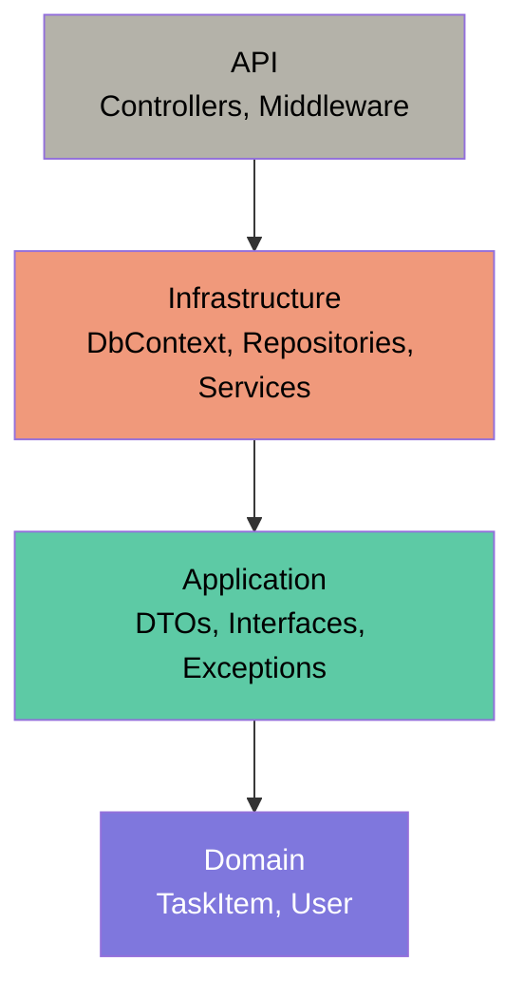

# Task Manager API

REST API built with .NET 8 and ASP.NET Core for managing tasks.

## Tech Stack
- .NET 8
- ASP.NET Core Web API
- Entity Framework Core
- SQL Server
- JWT Authentication
- BCrypt password hashing
- Clean Architecture (Domain / Application / Infrastructure / API)
- xUnit + Moq (unit testing)
- Docker (coming soon)
- Azure (coming soon)
- CI/CD GitHub Actions (coming soon)

## Endpoints
| Method | Route | Description |
|--------|-------|-------------|
| GET | /api/tasks | Get all tasks |
| GET | /api/tasks/{id} | Get task by ID |
| POST | /api/tasks | Create task |
| PUT | /api/tasks/{id} | Update task |
| DELETE | /api/tasks/{id} | Delete task |

## Running locally
```bash
dotnet run
```
Navigate to `https://localhost:{port}/swagger` to explore the API.

## Running with Docker

Prerequisites: Docker Desktop installed and running.

````bash
# Clone the repository
git clone https://github.com/vlopezf84/task-manager-api.git
cd task-manager-api

# Create the environment file
cp .env.example .env
# Edit .env and fill in the required values

# Start the API and SQL Server
docker compose up --build
````

API available at: `http://localhost:8080/swagger`

## Running locally

Prerequisites: .NET 8 SDK, SQL Server, Visual Studio 2022.

Configure User Secrets for the API project:
````bash
cd TaskManagerAPI
dotnet user-secrets set "ConnectionStrings:DefaultConnection" "your-connection-string"
dotnet user-secrets set "JwtSettings:SecretKey" "your-secret-key"
````

Then run with Visual Studio (`F5`) or:
````bash
dotnet run
````

## Architecture



Dependencies flow inward only. Domain has zero external dependencies — it knows nothing about EF Core, ASP.NET, or any infrastructure detail. This means switching database providers or frameworks never requires touching business logic.
